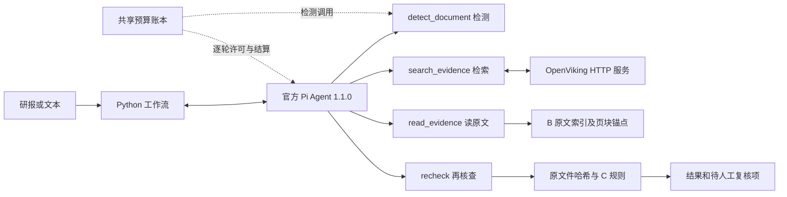

# Pi 调度、OpenViking 补证与节点优化

2026-10-09，在主线 `15312b3` 上完成首版集成。现在可以通过界面的「Pi 自动补证」或 `agent-check` / `agent-text` 入口运行新流程。原来的确定性核查入口保留，便于离线使用与对照。本机真实 OpenViking、中文 embedding 和 Pi 模型链已完成三例合成集成验证，尚无独立真实研报准确率结果；见 [真实服务验证](LOCAL_PI_SERVICE_VALIDATION_20261009.md)。

## 运行结构



Pi 负责安排四个业务工具。原文解析、检索结果回链、来源身份与数值核验仍由项目代码执行；Pi 的最终文字不能成为业务确认结论。嵌入真实 `@earendil-works/pi-agent-core` / `pi-ai` 1.1.0，依赖精确固定在 `agent_runtime/package-lock.json`。

OpenViking 客户端在 B 模块，按官方 v0.4.23 HTTP 接口实现上传、入库任务轮询、检索和原文读取。它连接已运行的 OpenViking 服务器，不会仅因安装 Python 客户端就自动获得向量数据库或 embedding 模型。服务器依赖和配置见 [B 接入文档](../pdfparse/docs/openviking.md)。

## 本轮节点改动

- 检测输出：同一候选的原文片段在重叠、紧邻或仅隔空白时合并，保存合并前的片段；不填充缺失词，不改变候选 ID、类型、状态和数量。
- 检索与读取：检索命中后必须读原文，核对文档、块、页、索引和原文件哈希。过期索引、来源变动、未知块不能进入确定性复核。
- 再核查：重新加载来源并执行原有 C 规则。没有被规则替代的模型候选、模型调用失败和待复核分母继续保留，不能因为补证而消失。
- 文本模式：外部事实核查单列，并反馈给 Pi；保持 FinED 文本候选原有标签和状态，避免跨任务混分。
- 运行控制：逐轮共享账本预留与结算；未知用量按预留上限记账；取消/超时后不再开始后续模型或检索请求，页面明确显示部分结果。

Pi 调度默认单轮输出 4096 token，独立于正文检测的较大输出设置。DeepSeek 的 `off/low/high/max` 设置原样适配，不将 `max` 静默降档。默认最多 6 模型轮、12 工具调用、总计 48000 token、180 秒总时限和 60 秒单工具时限；长文可通过 Python `AgentLimits` 调整，上限由 Node/Python 双方校验。

`max_cost_cny` / `--max-agent-cost` 只限制 Pi 调度请求，正文检测的模型调用另按原配置执行；两者都计入同一本累计账本。单次上限不会提高累计预算。不要建立新账本或修改历史费用来绕过已有额度。旧实验价格有效期已过，真实运行前必须更新为已核验的当前价格配置。

## 构建与运行

从仓库根目录执行，使用既有 Python 环境。Pi 需要 Node.js 22.19 或更高版本。

```powershell
Push-Location agent_runtime
npm.cmd ci --ignore-scripts --no-audit --no-fund
npm.cmd run build
Pop-Location

$env:PYTHONPATH='factcheck/src;pdfparse/src;.'
.venv\Scripts\python.exe -m yjcheck --help
.venv\Scripts\python.exe -m yjcheck kb health
```

配置沿用项目的 `YJCHECK_*` 模型设置和共享账本。OpenViking 客户端变量模板在 `pdfparse/deploy/openviking-client.env.example`；密钥放本地配置，不写进命令参数或版本库。

B 解析并 `export-kb` 后，目录必须包含 `ingest_manifest.json`、`kb_index.jsonl` 和带页块锚点的 Markdown。入库可能调用服务器的 embedding 模型；只有任务完成才作为可检索资源。

```powershell
.venv\Scripts\python.exe -m yjcheck kb ingest --directory pdfparse/data/kb
.venv\Scripts\python.exe -m yjcheck kb search --directory pdfparse/data/kb --query '营业收入'

.venv\Scripts\python.exe -m yjcheck agent-check --report '研报.pdf' --source '财报.pdf' --kb pdfparse/data/kb --out data/agent-runs --max-rounds 6 --max-agent-cost 2

.venv\Scripts\python.exe -m yjcheck agent-text --input '待检查.txt' --kb pdfparse/data/kb --out data/agent-runs
```

配对模式加 `--model` 可启用模型候选抽取和文本检测；文本模式本身使用模型检测。`--agent-output-tokens` 可调整调度输出上限。`--allow-fallback` 是显式本地 BM25 降级，结果保留 provider 和失败原因，不计为 OpenViking 语义检索成功。

界面沿用原启动方式，勾选「Pi 自动补证」，填写证据库目录。配对模式没有上传来源时，需要提供证据库才能开始。结果显示 Pi 状态、工具调用与补证过程；超时或中断后只展示已经完成的部分结果。

## 数据口径与实验

先运行 [数据准入](DATASET_READINESS.md)，再冻结数据角色、提示、模型配置、检索条件和评分器。442 篇已曝光语料仅作回归；CLFEC 中文编辑、FinVerBench 一致性、FinanceBench QA/断言分别评分。金标和带标签暗示的 ID 不进入提示或证据库。

本轮真实执行的是历史预测的生产节点回放。两组各恢复 22 个严格命中，评分器和分母不变。原版与节点版的详细计数在 [验证报告](PI_NODE_VALIDATION_20261009.md)。这不能视为 Pi/OpenViking 的效果提升。

服务就绪后的对照应固定同一数据与模型，分为原流程、仅节点优化、Pi 加相同节点、Pi 加 OpenViking 四组。报告全部提示 P/R/F1、经证据确认结果、失败/超时分母、费用与延迟，另做来源证据支持审核。未运行的组保持空白，不填入模拟结果。

## 工程验证

完整 Python 测试使用 pytest 9.0.2，已固定在 `factcheck/requirements-test.txt`；它包含 pytest 函数/参数化测试及原有 unittest 类。仅运行 `unittest discover` 会漏掉新增函数测试，不能作为完整验收。pytest 9 已内置子测试支持，不另装 `pytest-subtests`。

先完成上面的 Node 安装和构建，再从仓库根目录执行。`PYTHONPATH` 包含共享测试辅助模块路径，以便跨测试文件导入；`--import-mode=importlib` 避免多个测试目录的同名模块冲突。

```powershell
.venv\Scripts\python.exe -m pip install -r factcheck/requirements-test.txt -r pdfparse/requirements.txt
$env:PYTHONPATH='factcheck/src;factcheck/tests;pdfparse/src;pdfparse/tests;.'
.venv\Scripts\python.exe -m pytest --import-mode=importlib -q factcheck/tests pdfparse/tests evals/tests frontend/tests agent_runtime/tests
npm.cmd --prefix agent_runtime test
```

只检查收集是否完整时，为 Python 命令增加 `--collect-only`，收集成功不等于测试通过。上述 Python 范围已包含 `agent_runtime/tests/test_python_bridge.py`，不重复累计它。新 checkout 不包含本地 ONNX 权重；真实 embedding 集成测试会明确跳过，须按 [本地 embedding 说明](../pdfparse/deploy/README-local-embedding.md) 准备固定模型及运行依赖后另行验证。历史报告的“0 跳过”是原机器当次结果，不能外推为任意 checkout 的当前结果。

Node 测试使用真实 Pi SDK 与 localhost SSE；跨语言测试执行真实 Python→Node→Python 协议、逐轮账本许可和结算。OpenViking 接口测试使用本地 HTTP fixture，覆盖真实上传字节、查询与读取协议。它们验证工程流程，不测真实金融理解和向量召回质量。

初始检查时本机没有运行服务，随后按用户要求完成自建：OpenViking `127.0.0.1:1933`、本地中文 ONNX embedding `127.0.0.1:1934/v1` 已运行，启停脚本见 [本机部署](../pdfparse/deploy/LOCAL_OPENVIKING.md)。三份短来源实际入库与检索、三个真实 Pi 合成案例及重启持久化通过。金融新闻/训练语料本身不等于运行服务，也不自动满足财报原文证据契约。
